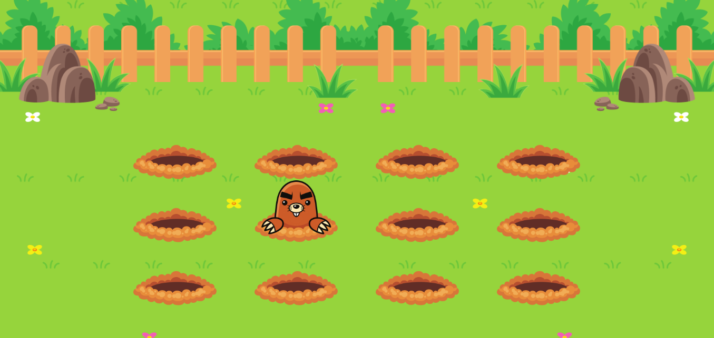

<h1 align="center"> Moles in the Garden </h1>

In this challenge, animations were created using CSS keyframes to make the moles appear in the garden.

  

  <a href="#-Technologies">Technologies</a>&nbsp;&nbsp;&nbsp;|&nbsp;&nbsp;&nbsp;
  <a href="#-Projects">Project</a>&nbsp;&nbsp;&nbsp;|&nbsp;&nbsp;&nbsp;
  <a href="#memo-License">License</a>

  

  

## Technologies 
- HTML
- CSS
- JavaScript
- Git
- GitHub
- Figma

## Project

In this challenge, animations were created using CSS keyframes to make the moles appear in the garden.

Applied responsiveness concepts

- Para acessar ao projeto finalizado, [clique aqui](https://fernandoalvesrufino.github.io/keyframe-moles-in-the-garden/).

 
## :memo: License

This project is licensed under the MIT license.

---

by Fernando Rufino

`Challenge created by Rocketseat`